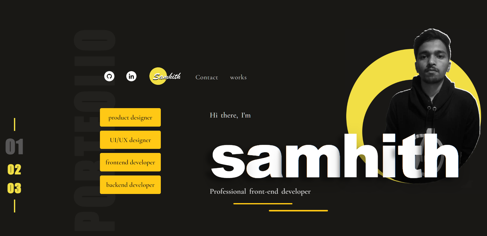

# Portfolio Website

This is my portfolio website showcasing my skills and projects as a frontend developer and UI/UX designer. The website is built using HTML, CSS, JavaScript, and GSAP for animations.

Check it out: [https://samhith.in](https://samhith.in/)

## Technologies Used
- HTML/CSS
- JavaScript
- GSAP (GreenSock Animation Platform)

## Installation & Setup

1. Clone the repository: `git clone https://github.com/samhithMR/portfolio.git`
2. Open the project in your preferred code editor.
3. Customize the content, styles, and projects to fit your own portfolio.
4. Run the website locally using a local development server or by opening the `index.html` file in your web browser.

## Forking this repo

While I believe in the value of open-source projects, it's disheartening to discover that someone has copied my site without giving credit. I've dedicated a significant amount of time and effort into building and designing this iteration of my portfolio website, and I take pride in it. Therefore, I kindly request that you refrain from claiming this work as your own

## About Me
I'm a passionate frontend developer/designer with expertise in custom website development and visually stunning interfaces. As a fresher, I'm actively seeking job opportunities and would appreciate any referrals. I'm also open to freelance projects and collaborations in frontend development and UI/UX design. Let's connect and discuss how we can work together to bring your ideas to life. Feel free to reach out to me with any inquiries or project opportunities.

Contact Me
-----------

Email: [samhith.mr@gmail.com](mailto:your-email@example.com)  
LinkedIn: [linkedin.com/in/samhith-mr](https://www.linkedin.com/in/samhith-mr) 
Website: [samhith.in](https://www.samhith.in)

